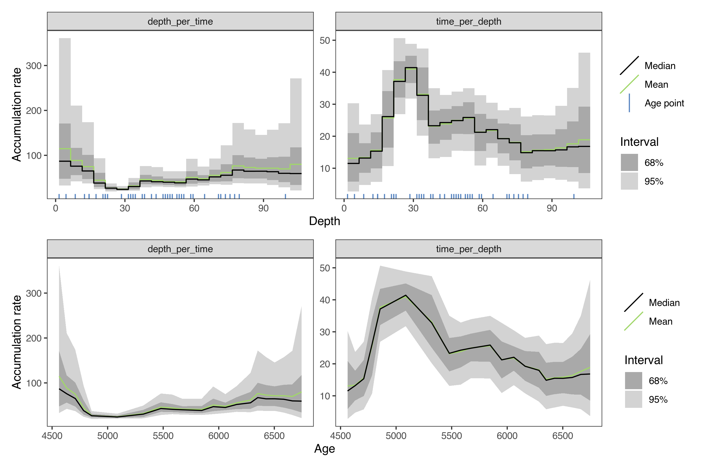

hamstrbacon: An Interface Between rbacon and hamstr.
================
Andrew M. Dolman
2025-05-02

------------------------------------------------------------------------

## Installation

**hamstrbacon** can be installed directly from Github

``` r
if (!require("remotes")) {
  install.packages("remotes")
}

remotes::install_github("earthsystemdiagnostics/hamstrbacon")
```

## Fitting age-models with **rbacon** via **hamstrbacon**

Using the example core “MSB2K” from the
[rbacon](https://cran.r-project.org/web/packages/rbacon/index.html)
package.

``` r
library(hamstrbacon)
```

``` r
hambac_1 <- hamstr_bacon(id = "tst", 
                         depth = MSB2K$depth,
                         obs_age = MSB2K$age,
                         obs_err = MSB2K$error,
                         thick = 5, cc = 1, 
                         # pass seed to rbacon so that mcmc sample is the same
                         # each time for the example
                         seed = 20220103
                         )
#> The run's files will be put in this folder: /private/var/folders/w7/h2mftm493q51t0v8grt97cbnhy0_jv/T/RtmpgO5rDL
#> Warning in file(con, "r"): file("") only supports open = "w+" and open = "w+b":
#> using the former
#> Reading /private/var/folders/w7/h2mftm493q51t0v8grt97cbnhy0_jv/T/RtmpgO5rDL/RtmpgO5rDL_21.bacon
#> Constant calibration curve.
#> IntCal20: Reading from file: /Library/Frameworks/R.framework/Versions/4.3-arm64/Resources/library/rintcal/extdata/3Col_intcal20.14C
#> Marine20: Reading from file: /Library/Frameworks/R.framework/Versions/4.3-arm64/Resources/library/rintcal/extdata/3Col_marine20.14C
#> SHCal20: Reading from file: /Library/Frameworks/R.framework/Versions/4.3-arm64/Resources/library/rintcal/extdata/3Col_shcal20.14C
#> Added det: tst: 4128.0+-65.0   d=1.5 ResCorr=   0.0+-0.0    a=3 b=4 cc=IntCal20
#> Added det: tst: 4106.0+-60.0   d=4.5 ResCorr=   0.0+-0.0    a=3 b=4 cc=IntCal20
#> Added det: tst: 4046.0+-59.0   d=8.5 ResCorr=   0.0+-0.0    a=3 b=4 cc=IntCal20
#> Added det: tst: 4184.0+-58.0   d=12.5 ResCorr=   0.0+-0.0    a=3 b=4 cc=IntCal20
#> Added det: tst: 4076.0+-62.0   d=14.5 ResCorr=   0.0+-0.0    a=3 b=4 cc=IntCal20
#> Added det: tst: 4107.0+-61.0   d=14.5 ResCorr=   0.0+-0.0    a=3 b=4 cc=IntCal20
#> Added det: tst: 4097.0+-58.0   d=14.5 ResCorr=   0.0+-0.0    a=3 b=4 cc=IntCal20
#> Added det: tst: 4177.0+-53.0   d=17.5 ResCorr=   0.0+-0.0    a=3 b=4 cc=IntCal20
#> Added det: tst: 4220.0+-59.0   d=20.5 ResCorr=   0.0+-0.0    a=3 b=4 cc=IntCal20
#> Added det: tst: 4281.0+-64.0   d=21.5 ResCorr=   0.0+-0.0    a=3 b=4 cc=IntCal20
#> Added det: tst: 4374.0+-64.0   d=21.5 ResCorr=   0.0+-0.0    a=3 b=4 cc=IntCal20
#> Added det: tst: 4493.0+-62.0   d=22.5 ResCorr=   0.0+-0.0    a=3 b=4 cc=IntCal20
#> Added det: tst: 4452.0+-52.0   d=28.5 ResCorr=   0.0+-0.0    a=3 b=4 cc=IntCal20
#> Added det: tst: 4616.0+-64.0   d=31.5 ResCorr=   0.0+-0.0    a=3 b=4 cc=IntCal20
#> Added det: tst: 4662.0+-64.0   d=32.5 ResCorr=   0.0+-0.0    a=3 b=4 cc=IntCal20
#> Added det: tst: 4743.0+-67.0   d=33.5 ResCorr=   0.0+-0.0    a=3 b=4 cc=IntCal20
#> Added det: tst: 4638.0+-67.0   d=34.5 ResCorr=   0.0+-0.0    a=3 b=4 cc=IntCal20
#> Added det: tst: 4810.0+-67.0   d=37.5 ResCorr=   0.0+-0.0    a=3 b=4 cc=IntCal20
#> Added det: tst: 4757.0+-82.0   d=38.5 ResCorr=   0.0+-0.0    a=3 b=4 cc=IntCal20
#> Added det: tst: 4839.0+-59.0   d=41.5 ResCorr=   0.0+-0.0    a=3 b=4 cc=IntCal20
#> Added det: tst: 4913.0+-65.0   d=43.5 ResCorr=   0.0+-0.0    a=3 b=4 cc=IntCal20
#> Added det: tst: 4880.0+-57.0   d=46.5 ResCorr=   0.0+-0.0    a=3 b=4 cc=IntCal20
#> Added det: tst: 4989.0+-70.0   d=47.5 ResCorr=   0.0+-0.0    a=3 b=4 cc=IntCal20
#> Added det: tst: 5070.0+-66.0   d=48.5 ResCorr=   0.0+-0.0    a=3 b=4 cc=IntCal20
#> Added det: tst: 4993.0+-67.0   d=49.5 ResCorr=   0.0+-0.0    a=3 b=4 cc=IntCal20
#> Added det: tst: 5115.0+-79.0   d=50.5 ResCorr=   0.0+-0.0    a=3 b=4 cc=IntCal20
#> Added det: tst: 5026.0+-51.0   d=52.5 ResCorr=   0.0+-0.0    a=3 b=4 cc=IntCal20
#> Added det: tst: 5242.0+-64.0   d=53.5 ResCorr=   0.0+-0.0    a=3 b=4 cc=IntCal20
#> Added det: tst: 5159.0+-50.0   d=54.5 ResCorr=   0.0+-0.0    a=3 b=4 cc=IntCal20
#> Added det: tst: 5130.0+-66.0   d=55.5 ResCorr=   0.0+-0.0    a=3 b=4 cc=IntCal20
#> Added det: tst: 5238.0+-65.0   d=58.5 ResCorr=   0.0+-0.0    a=3 b=4 cc=IntCal20
#> Added det: tst: 5293.0+-38.0   d=59.5 ResCorr=   0.0+-0.0    a=3 b=4 cc=IntCal20
#> Added det: tst: 5293.0+-54.0   d=64.5 ResCorr=   0.0+-0.0    a=3 b=4 cc=IntCal20
#> Added det: tst: 5368.0+-51.0   d=70.5 ResCorr=   0.0+-0.0    a=3 b=4 cc=IntCal20
#> Added det: tst: 5498.0+-69.0   d=71.5 ResCorr=   0.0+-0.0    a=3 b=4 cc=IntCal20
#> Added det: tst: 5588.0+-55.0   d=73.5 ResCorr=   0.0+-0.0    a=3 b=4 cc=IntCal20
#> Added det: tst: 5514.0+-57.0   d=75.5 ResCorr=   0.0+-0.0    a=3 b=4 cc=IntCal20
#> Added det: tst: 5535.0+-52.0   d=77.5 ResCorr=   0.0+-0.0    a=3 b=4 cc=IntCal20
#> Added det: tst: 5644.0+-77.0   d=79.5 ResCorr=   0.0+-0.0    a=3 b=4 cc=IntCal20
#> Added det: tst: 5885.0+-45.0   d=99.5 ResCorr=   0.0+-0.0    a=3 b=4 cc=IntCal20
#> Since no file /private/var/folders/w7/h2mftm493q51t0v8grt97cbnhy0_jv/T/RtmpgO5rDL/RtmpgO5rDL_21.bacon.init was provided with initial values for the twalk, I will be using simulated values.
#> BaconFixed: Bacon jumps model with fixed c's.
#>             K=21, H=0, dim=23, Seed=20220103, Dc=5.000000, c(0)=1.500000, c(K)=106.500000
#> 
#> twalk:      2875000 iterations to run, Fri May  2 14:03:38 2025
#>        
#> BUFSIZ is 1024, optimal block size changed to 4096
#> twalk: All stored iterations to be saved in file /private/var/folders/w7/h2mftm493q51t0v8grt97cbnhy0_jv/T/RtmpgO5rDL/RtmpgO5rDL_21.out
#> twalk: Finished,  0.7% of moved pars per iteration (ratio 20012.869565/2875000). Output in file /private/var/folders/w7/h2mftm493q51t0v8grt97cbnhy0_jv/T/RtmpgO5rDL/RtmpgO5rDL_21.out,
#>       Fri May  2 14:03:42 2025
#> 
#> Writing two last points of the twalk in /private/var/folders/w7/h2mftm493q51t0v8grt97cbnhy0_jv/T/RtmpgO5rDL/RtmpgO5rDL_21.bacon.last.
#> bacon: burn in (initial iterations which will be removed): 1725000
#> Eso es to...eso es to...eso es to...eso es toooodo amigos!
#> Previous runs of core RtmpgO5rDL with thick=5 cm deleted. Now try running the core again
```

### Plot the Bacon model with hamstr plotting functions

``` r
plot(hambac_1)
```

<!-- -->

### Extract summary downcore age-depth model

``` r
summary(hambac_1)
#> # A tibble: 22 × 10
#>    depth  mean    sd `2.5%` `15.9%` `25%` `50%` `75%` `84.1%` `97.5%`
#>    <dbl> <dbl> <dbl>  <dbl>   <dbl> <dbl> <dbl> <dbl>   <dbl>   <dbl>
#>  1   1.5 4565.  70.3  4433.   4495. 4526. 4563. 4607.   4630.   4710 
#>  2   6.5 4630.  69.7  4485.   4560. 4581. 4632. 4679.   4701.   4762.
#>  3  11.5 4697.  64.4  4565.   4623. 4649. 4709. 4744.   4759.   4802.
#>  4  16.5 4765.  55.6  4643.   4700. 4723. 4784. 4806.   4816.   4840.
#>  5  21.5 4864.  48.8  4768.   4828. 4839. 4856. 4885.   4913.   4971.
#>  6  26.5 5082. 106.   4884.   4963. 5002. 5087. 5164.   5199.   5259.
#>  7  31.5 5330.  64.9  5208.   5272. 5289. 5321. 5377.   5405.   5449.
#>  8  36.5 5479.  46.1  5376.   5437. 5452. 5479. 5508.   5525.   5566.
#>  9  41.5 5579.  43.5  5489.   5535. 5554. 5582. 5603.   5622.   5660.
#> 10  46.5 5677.  52.9  5586.   5631. 5641. 5674. 5706.   5719.   5828.
#> # ℹ 12 more rows
```

### Get the individual model realisations

``` r
predict(hambac_1)
#> # A tibble: 99,022 × 3
#>     iter depth   age
#>    <dbl> <dbl> <dbl>
#>  1   501   1.5 4691.
#>  2   501   6.5 4730.
#>  3   501  11.5 4742.
#>  4   501  16.5 4802.
#>  5   501  21.5 4851.
#>  6   501  26.5 4986.
#>  7   501  31.5 5299.
#>  8   501  36.5 5535.
#>  9   501  41.5 5636.
#> 10   501  46.5 5714.
#> # ℹ 99,012 more rows
```

### Plot the accumulation rates

``` r
plot(hambac_1, type = "acc")
#> Joining with `by = join_by(depth)`
```

<!-- -->

Smooth the accumulation rates with 10 cm filter before calculating the
statistics

``` r
plot(hambac_1, type = "acc", tau = 10)
#> Joining with `by = join_by(depth)`
```

<!-- -->

### Get the ages interpolated at specific depths

``` r
spec_depths <- predict(hambac_1, depth = c(10:15))

spec_depths
#> # A tibble: 27,006 × 3
#>     iter depth   age
#>    <int> <int> <dbl>
#>  1     1    10 4738.
#>  2     1    11 4741.
#>  3     1    12 4748.
#>  4     1    13 4760.
#>  5     1    14 4772.
#>  6     1    15 4784.
#>  7     2    10 4738.
#>  8     2    11 4740.
#>  9     2    12 4747.
#> 10     2    13 4759.
#> # ℹ 26,996 more rows
```

Summary also works after interpolation

``` r
summary(spec_depths)
#> # A tibble: 6 × 10
#>   depth  mean    sd `2.5%` `15.9%` `25%` `50%` `75%` `84.1%` `97.5%`
#>   <int> <dbl> <dbl>  <dbl>   <dbl> <dbl> <dbl> <dbl>   <dbl>   <dbl>
#> 1    10 4676.  62.5  4552.   4607. 4628. 4688. 4722.   4736.   4785.
#> 2    11 4690.  63.4  4561.   4619. 4642. 4702. 4737.   4751.   4796.
#> 3    12 4703.  62.1  4577.   4632. 4656. 4717. 4749.   4763.   4804.
#> 4    13 4717.  58.2  4596.   4651. 4669. 4734. 4760.   4771.   4808.
#> 5    14 4731.  55.5  4610.   4669. 4683. 4752. 4772.   4780.   4813.
#> 6    15 4744.  54.4  4626.   4683. 4699. 4767. 4785.   4793.   4818.
```

### References

- Blaauw, Maarten, and J. Andrés Christen. 2011. Flexible Paleoclimate
  Age-Depth Models Using an Autoregressive Gamma Process. Bayesian
  Analysis 6 (3): 457-74. <doi:10.1214/ba/1339616472>.
